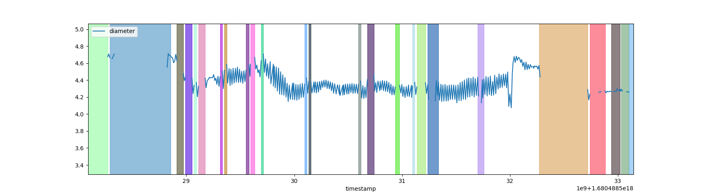

# blink_detect_live
A blink detection algorithm ROS package that takes a live stream of pupil diameter message as input, publishes blink message including onset, offset, duration and count.

The live blink detection is based on this paper in which a static algorithm is proposed to detect the onset and offset of blinks by analyzing the fluctuations in the pupil data that result from measurement error produced by the eye-tracking device. See https://pubmed.ncbi.nlm.nih.gov/29340968/

This repository applies dynamic programming, one-pass reads pupil diameter stream.

The blue line represents the pupil diameter stream. Colored blocks denote blinks.
# Description
The BlinkDetector class subscribes to the pupil diameter topic and processes the data in real time. It maintains a buffer of recent pupil diameter samples and timestamps, which is used to calculate the smoothed diameter. When a blink is detected, the node publishes a Blink message with the onset, offset, and duration of the blink event.
## Parameters
 - `concat_gap_interval` (int): The minimum number of samples between two consecutive blink events for them to be considered separate. The default value is 5.
 - `samples2smooth` (int): The number of samples used to smooth the pupil diameter data. It should be an odd number. The default value is 11.
   
 - `@staticmethod smooth(x: float[], window_len: int) -> int`: filter function that takes raw pupil diameter and window size as parameters.

## Topics

### Subscribed topics
 - `/humans/faces/face_(id)/eyes/left/pupildiameter` (PupilDiameter)
 - `/humans/faces/face_(id)/eyes/right/pupildiameter` (PupilDiameter)
### Published topics
 - `/humans/faces/face_(id)/eyes/left/blink` (Blink)
 - `/humans/faces/face_(id)/eyes/right/blink` (Blink)
## Messages
### PupilDiameter
 - `float64 diameter`: Pupil diameter in millimetres. NaN indicates a blink event.
 - `time timestamp`: Timestamp of the measurement.
### Blink
 - `time onset`: Timestamp of the onset of the blink event.
 - `time offset`: Timestamp of the offset of the blink event.
 - `duration duration`: Duration of the blink event.
 - `int32 count`: Sequential count of the blink event.

# Citation to use
if you are using this code, please add a citation as described at the bottom of https://git.initrobots.ca/aduval/bio_physics.

